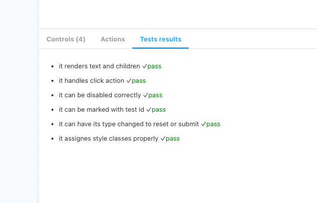

Addon meant to display Vitest unit test results in a new Stoybook panel. Developed and tested with React.

Example usage:

```
// Component.stories.tsx

import vitestResults from "./unit-test-results.json";
/.../
export default {
  title: "Example/Component",
  component: Header,
  parameters: {
    vitest: {
      testFile: "Header.test.tsx",
       results: vitestResults,
    },
  },
};
/.../
```


