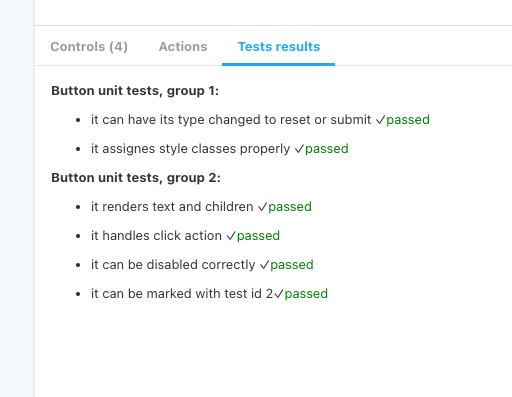

## storybook_vitest_addon

###

[](https://github.com/krzysztofradomski/storybook-addon-vitest/actions/workflows/ci.yml)
[](https://github.com/krzysztofradomski/storybook-addon-vitest/actions/workflows/release.yml)
[](https://www.npmjs.com/package/storybook_vitest_addon)

Installation:

```
npm install storybook_vitest_addon
```

```
pnpm install storybook_vitest_addon
```

```
yarn add storybook_vitest_addon
```

Compatibility:

```
"storybook": "^10.4.2",
"vite": "^8.0.0",
"@vitejs/plugin-react": "^6.0.2",
"react": "^19.0.0",
"typescript": "^6.0.0",
"vitest": "^1.1.0"
```

> **Note:** As of v0.1.8, this addon targets **Storybook 10** (unified `storybook` package),
> **Vite 8**, **React 19**, and **TypeScript 6**. The old `@storybook/react` and
> `@storybook/react-vite` v8 peer dependencies are no longer required.

Description:

Addon meant to display Vitest unit test results in a new Stoybook panel. Developed and tested with React.
Simply add it to the addon list in your Storybook config, and then you can use it in any story.

The addon offers minimal visuals for maximum clarity.
It needs 2 params: `testResults` - test results file in json format and `testFile` - name of the component test file (TypeScript definitions available).

Example usage:

```

// Button.stories.tsx

import vitestResults from "./unit-test-results.json";
/.../
export default {
  title: "Example/Button",
  component: Button,
  parameters: {
    vitest: {
      testFile: "Button.test.tsx",
      testResults: vitestResults,
    },
  },
};
/.../

```



Also see https://storybook.js.org/addons/storybook_vitest_addon
